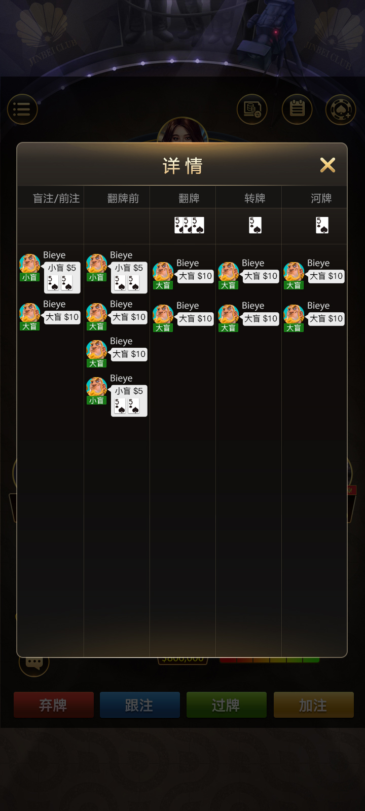
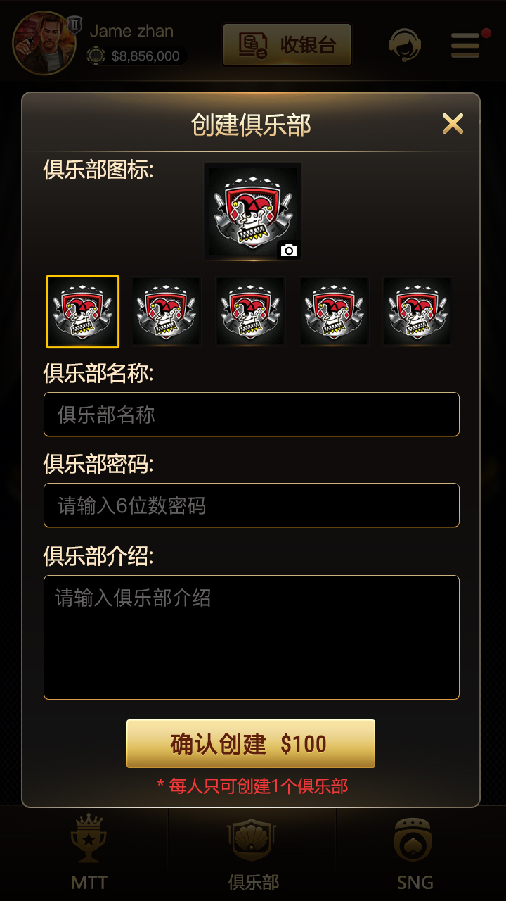

[简体中文](README.md) | [繁體中文](README.zh-TW.md) | [English](README.en.md) | [Visual site](https://masterai-top.github.io/Texas-Hold-em-Source-Code_Texas-Hold-em/en/)

# Texas Holdem Source Code: C++ Server and TypeScript Client

This repository documents code-level parts of a multiplayer Texas Holdem project: the **game-round core, room messaging bridge, club handlers, and client message layer**. The description is grounded in the files present in the repository instead of presenting it as an undifferentiated complete platform.

## Distinct repository focus

Unlike the complete-solution, club-platform, tournament, and CFR AI repositories under `masterai-top`, this project focuses on the implementation layer.

| Area | Evidence in this repository |
| --- | --- |
| Round lifecycle | `core/gamebegin.h`, `core/gamecalculate.h`, `core/gameend.h` |
| Timers and card delivery | `core/begintimer.h`, `core/endtimer.h`, `core/sendhdcard.h` |
| Room messaging | `gameserver.cpp`, `onclientmessage.cpp`, `sendclientmessage.cpp` |
| Client messaging | `MsgHandlerModel.ts`, `EventBind.ts`, `EventDefine.ts` |
| Club handlers | `create_club.h`, `change_position_club.h`, `check_cut_club.h` |
| Protocol and service layer | Tars, Protobuf, asynchronous sockets, and a third-party TCP client |

## Game flow

1. The client message model handles lobby room lists, table entry, and reconnection-related events.
2. `gameconfig.cpp` loads room type, seats, blinds, action timers, and round settings.
3. The game core checks start conditions and advances through timers, card delivery, and player actions.
4. Calculation and end modules produce the result and send completion data to the room and clients.

## Visible product capabilities

- Table controls for fold, call, check, and raise
- Hand-history list and street-by-street detail
- In-table chat and hand information
- Club creation and club table browsing
- Entry points for Holdem, All-in or Fold, and 6+ Short Deck
- MTT and SNG entry points; TypeScript files include MTT room events and status definitions

## Technical map

| Layer | Repository content |
| --- | --- |
| C++ game service | `GameRoot`, `GameServer`, round lifecycle, timers, settlement, and room data exchange |
| TypeScript client modules | startup, loading, event binding, message encoding/decoding, lobby and room state |
| Communication | Tars interfaces, Protobuf messages, asynchronous sockets, third-party TCP client |
| Club operations | create club, change position, and club configuration checks |

## Product screenshots

| Table and chat | Hand history |
| --- | --- |
|  |  |
| Club tables | Create club |
|  |  |

## Contact

- Telegram: [@xuzongbin001](https://t.me/xuzongbin001)
- Email: [masterai918@gmail.com](mailto:masterai918@gmail.com)

The exact delivery scope, dependencies, and buildability should be confirmed against a written source manifest. This repository is intended for lawful software evaluation, technical research, and licensed project discussions.
