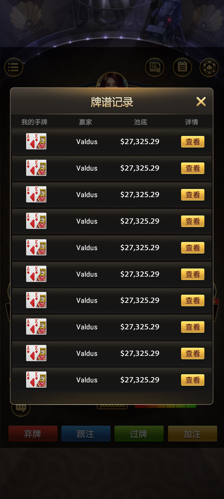

[简体中文](README.md) | [繁體中文](README.zh-TW.md) | [English](README.en.md) | [图文网站](https://masterai-top.github.io/Texas-Hold-em-Source-Code_Texas-Hold-em/)

# 德州扑克源码：C++ 服务端与 TypeScript 客户端

本仓库是一套面向多人德州扑克开发的**德州源码**项目，展示游戏回合核心、房间消息桥接、俱乐部接口和客户端消息层。页面以“德州扑克、德州源码”为主关键词，并围绕真实代码文件说明牌局怎样开始、计时、发牌、结算，以及 C++/Tars 与 TypeScript/Protobuf 如何连接房间和客户端。

## 德州扑克源码定位

与 `masterai-top` 下的完整解决方案、通用俱乐部、赛事平台和 CFR AI 项目相比，本仓库聚焦**代码级游戏核心**：

| 方向 | 仓库中的真实依据 |
| --- | --- |
| 游戏回合 | `core/gamebegin.h`、`core/gamecalculate.h`、`core/gameend.h` |
| 计时与发牌 | `core/begintimer.h`、`core/endtimer.h`、`core/sendhdcard.h` |
| 房间消息 | `gameserver.cpp`、`onclientmessage.cpp`、`sendclientmessage.cpp` |
| 客户端消息层 | `MsgHandlerModel.ts`、`EventBind.ts`、`EventDefine.ts` |
| 俱乐部接口 | `create_club.h`、`change_position_club.h`、`check_cut_club.h` |
| 协议与服务 | Tars、Protobuf、异步 Socket 与第三方连接模块 |

## 牌局运行流程

1. **进入房间**：客户端消息模型处理大厅房间列表、入桌与重连相关事件。
2. **读取配置**：`gameconfig.cpp` 加载房间类型、座位数、盲注、操作时间和局数等参数。
3. **开始与计时**：游戏核心检查开局条件，进入开始计时、发牌和行动阶段。
4. **计算与结束**：结算模块处理牌局结果，再将结束消息返回房间服务与客户端。

## 可见产品功能

- 牌桌操作界面以及弃牌、跟注、过牌、加注入口
- 牌谱列表与逐街详情，覆盖翻牌前、翻牌、转牌、河牌
- 桌内聊天及牌局信息展示
- 创建俱乐部、俱乐部大厅和牌桌列表
- 经典德州、AOF 与 6+ 短牌入口
- MTT、SNG 入口；TypeScript 中包含 MTT 房间事件与状态定义

> 上述功能由仓库代码名称和线上 README 的现有产品截图交叉核对。完整交付范围、依赖与可构建性应以双方确认的源码清单为准。

## 技术结构

| 层 | 内容 |
| --- | --- |
| C++ 游戏服务 | `GameRoot`、`GameServer`、回合、计时、结算与房间数据收发 |
| TypeScript 客户端模块 | 启动、加载、事件绑定、消息编码/解码与大厅/房间状态 |
| 通信 | Tars 接口、Protobuf 消息、异步 Socket、第三方 TCP 客户端 |
| 俱乐部 | 创建俱乐部、切换位置和俱乐部配置检查接口 |
| 可配置项 | 房间类型、盲注、座位数、行动时间、局数等 |

## 产品截图

| 牌桌与聊天 | 牌谱列表与详情 |
| --- | --- |
|  |  |
| 俱乐部牌桌 | 创建俱乐部 |
|  |  |

更多真实界面：[牌桌设置](docs/assets/images/poker-table.jpg) · [逐街牌谱详情](docs/assets/images/hand-history-detail.jpg)

## 适合谁评估

- 需要研究 C++ 多人牌局回合、计时与结算结构的团队
- 需要理解 TypeScript 客户端如何接入 Protobuf 消息的开发者
- 正在评估俱乐部房间、牌谱和客户端交互流程的产品团队
- 需要在现有游戏服务基础上进行二次开发的工程团队

## 联系与说明

- Telegram: [@xuzongbin001](https://t.me/xuzongbin001)
- Email: [masterai918@gmail.com](mailto:masterai918@gmail.com)

本仓库用于合法的软件评估、技术研究与授权项目沟通，不构成上线、合规或性能承诺。
